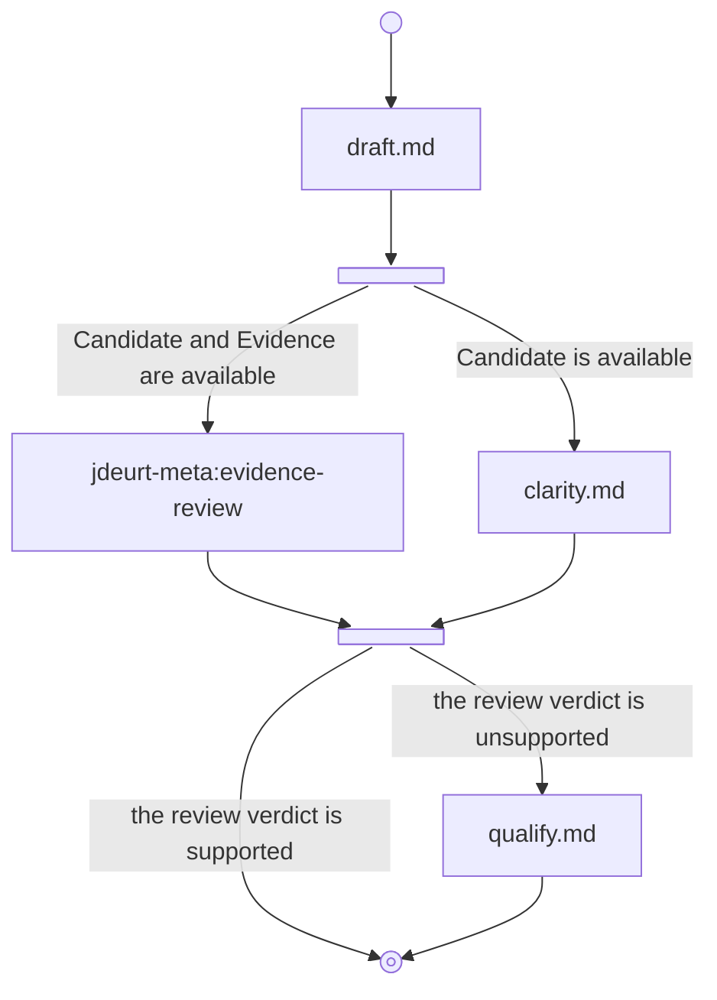

```mermaid
flowchart TD
_start@{ shape: sm-circ, label: "Start" }
draft["draft.md"]
split@{ shape: fork, label: "Fork or Join" }
%% subagent:fresh
review["jdeurt-meta:evidence-review"]
%% subagent:inherit
clarity["clarity.md"]
gather@{ shape: fork, label: "Fork or Join" }
qualify["qualify.md"]
_stop@{ shape: framed-circle, label: "Stop" }
_start --> draft
draft --> split
split -->|Candidate and Evidence are available| review
split -->|Candidate is available| clarity
review --> gather
clarity --> gather
gather -->|the review verdict is supported| _stop
gather -->|the review verdict is unsupported| qualify
qualify --> _stop
```

## Notes

- Execute with jdeurt-meta:graph-workflows. Distribute this skill together with jdeurt-meta:evidence-review.
